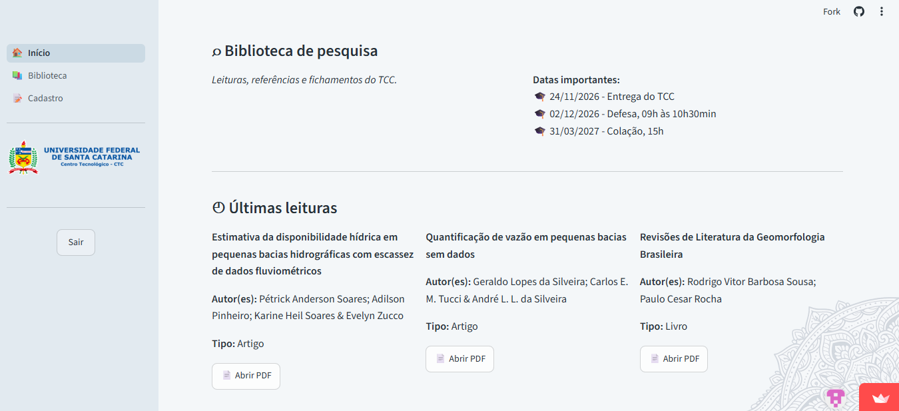

# 📚 Fichamentos

Aplicação web pessoal para organizar fichamentos acadêmicos e acessar os respectivos PDFs de qualquer lugar.

O projeto foi criado para facilitar o acesso aos materiais da faculdade em diferentes computadores, sem depender de plataformas pagas.

## ✨ Funcionalidades

- 🔐 Autenticação de usuário
- 📚 Cadastro de fichamentos
- 📄 Upload e armazenamento de PDFs
- 🔎 Busca por título, autor(es) e anotações
- 🏷️ Filtro por tipo de documento
- ✏️ Edição de fichamentos
- 🗑️ Exclusão de fichamentos
- 🕐 Últimas leituras
- 🔗 Acesso aos PDFs pelo navegador

## 🛠️ Tecnologias

- Python
- Streamlit
- Supabase
- PostgreSQL

## 🔒 Segurança

As credenciais do Supabase são armazenadas através dos Secrets do Streamlit e não fazem parte do código-fonte.

## 🎯 Objetivo

Projeto desenvolvido para uso pessoal e acadêmico, com foco em organização, praticidade e acesso aos materiais de estudo de qualquer computador com internet. 

## 📸 Interface

  

 
